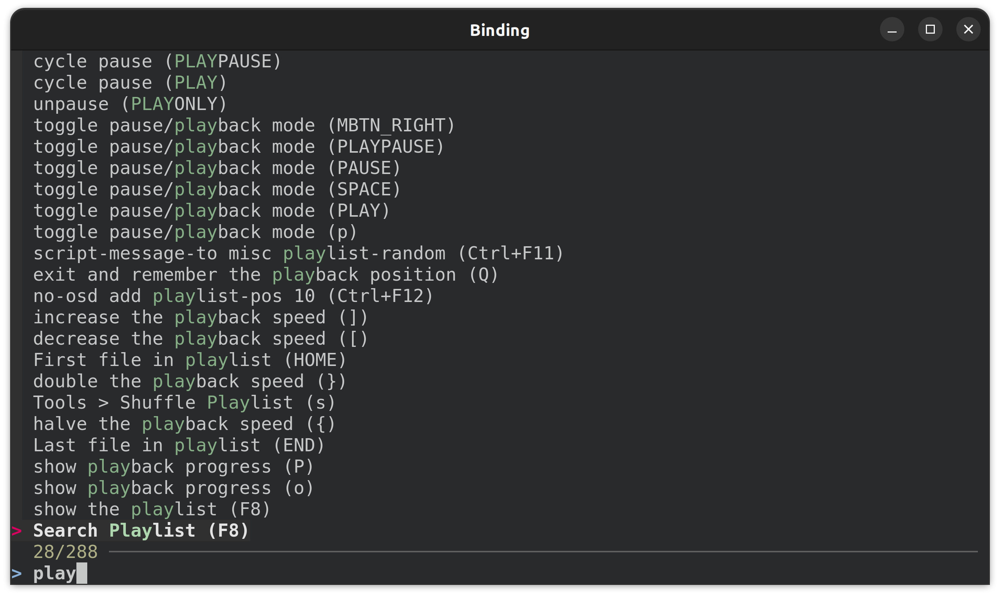
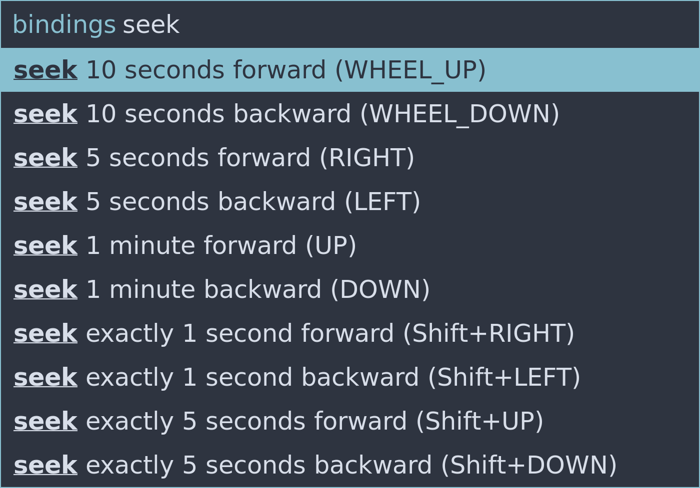
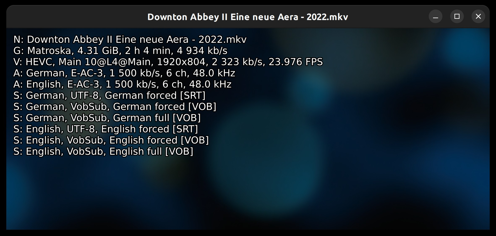

Collection of mpv scripts for Windows and Linux, macOS support is limited.

search_menu is documented here, all other scripts are
documented directly in the script via code comment
at the beginning of the script.

- [search_menu](#search_menu) - Searchable menu to search for bindings, commands, properties, playlist entries and audio/subtitle tracks.
- [auto-mode.lua](auto-mode.lua) - Use mpv as video player, music player and image viewer.
- [delete-current-file.lua](delete-current-file.lua) - Moves the currently playing file instantly to the recycle bin.
- [file-rating.lua](file-rating.lua) - Writes a star rating to the filename of the currently playing file.
- [history.lua](history.lua) - Writes date, time, playtime and filename to a log file.
- [osm.lua](osm.lua) - Shows a customizable on screen menu.
- [misc.lua](misc.lua)
  - Show detailed media info on screen ([Screenshot](#screenshot-misclua)).
  - Cycle audio and subtitle tracks, include only languages you know.
  - Load or append files/URLs from clipboard.
  - Jump to a random position in the playlist.
  - Navigate in playlist to next/previous/first/last file.
  - Restart mpv restoring the properties path, time-pos, pause and volume.
  - Execute Lua code from input.conf.
  - When seeking display position and duration like so: 70:00 / 80:00.
- [smart-volume.lua](smart-volume.lua) - Records and restores the relative volume for music.

# search_menu

### About

search_menu is a searchable menu (command palette) based on [Rofi](https://github.com/davatorium/rofi) (Linux) or terminal based on [fzf](https://github.com/junegunn/fzf) (cross-platform).

It provides a searchable menu for bindings, commands, properties, playlist entries and audio/subtitle tracks.





### Installation

See Dependencies section to install dependencies.

Save the search menu folder at `~~/scripts/search_menu/`,
it contains main.lua and a Python script.

### Configuration

#### mpv.conf

Windows: `input-ipc-server = \\.\pipe\mpvsocket`

Linux: `input-ipc-server = /tmp/mpvsocket`

#### Conf file at `~~/scripts-opts/search_menu.conf`:

```
#mode=gnome-terminal+sh    # Requires Linux and Gnome Terminal, default on Linux
#mode=alacritty+sh         # Requires Linux and Alacritty
#mode=rofi                 # Requires Linux and Rofi
#mode=alacritty+ns         # Requires Windows, Alacritty and Nushell
#mode=windows-terminal+ps  # Requires Windows and Windows Terminal, default on Windows
#mode=windows-terminal+ns  # Requires Windows, Windows Terminal and Nushell
```

On Windows Alacritty and Nushell have the advantage of a faster startup.

On Linux Alacritty has the advantage of not having any UI apart from the terminal.

Rofi has like mpv a steep learning curve.

#### input.conf:

```
F1 script-message-to search_menu show-search-menu binding        # Search Binding
F2 script-message-to search_menu show-search-menu binding-full   # Search Binding Full
F3 script-message-to search_menu show-search-menu command        # Search Command
F4 script-message-to search_menu show-search-menu property       # Search Property
F8 script-message-to search_menu show-search-menu playlist       # Search Playlist
Alt+a script-message-to search_menu show-search-menu audio-track # Search Audio Track
Alt+s script-message-to search_menu show-search-menu sub-track   # Search Subtitle Track
```

### Dependencies

Which dependencies are required depend
on which mode and feature is used.

- [Python](https://www.python.org) - Always required.
- [Rofi](https://github.com/davatorium/rofi) - Required launcher app for rofi mode, depends on Linux and X11.
- [fzf](https://github.com/junegunn/fzf) - Required CLI tool for modes other than rofi (terminal modes).
- [MediaInfo](https://mediaarea.net/en/MediaInfo) - Required CLI tool to search audio or subtitle tacks.
- [Alacritty](https://alacritty.org) - Modern, simple and fast terminal emulator.
- [Nushell](https://www.nushell.sh) - Modern shell that starts 200 ms faster than PowerShell.

### Usage

Invoke a menu via shortcut key, type a search keyword, use up/down key to select,
enter key to confirm, escape key to close.

### Related Projects

- https://github.com/Seme4eg/mpv-scripts/tree/master#m-x
- https://github.com/CogentRedTester/mpv-search-page
- https://codeberg.org/NRK/mpv-toolbox/src/branch/master/mdmenu
- https://github.com/mpvnet-player/mpv.net
- https://github.com/tsl0922/ImPlay

# Screenshot misc.lua

misc.lua has various features, among them is printing media info on the screen.


